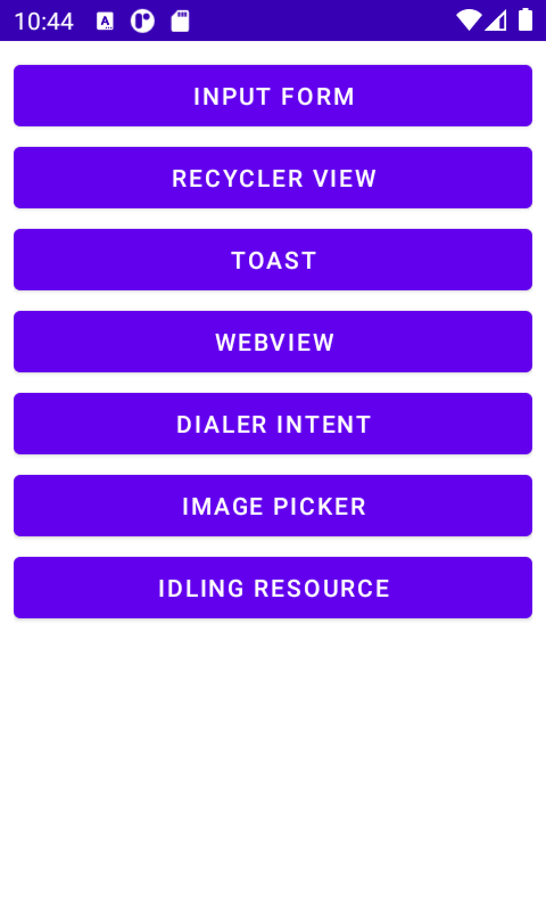

# EspressoTemplate 

### ET a simple app to practice different types of view interractions in espresso UI tests

## App currently contains screens:
1. Input form
2. RecyclerView
3. Toast
4. WebView
5. Dialer intent
6. Image Picker

