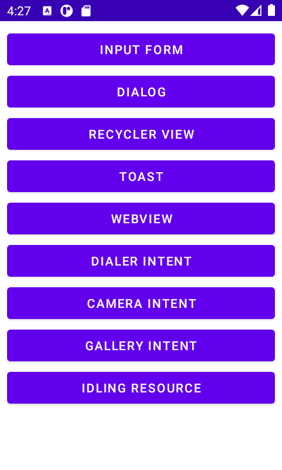

# EspressoTemplate 

### ET a simple app to practice different types of view interractions in espresso UI tests

## App currently contains screens:
1. Input form
2. Dialog
3. RecyclerView
4. Toast
5. WebView
6. Dialer intent
7. Camera intent
8. Gallery intent

---

